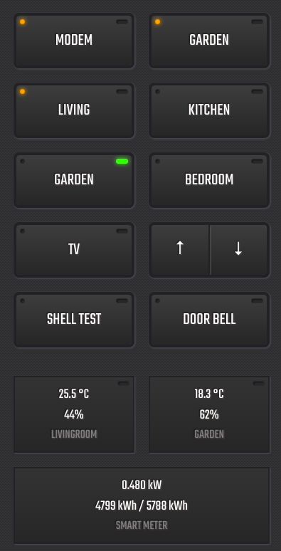

This project is pre-pre-pre-alpha, so don't expect a working solution.

# Screenshots




# Setup

First make sure you have the DOMUSTO server up and running: https://github.com/basvdijk/domusto-server-nodejs

## Install npm packages

``` bash
npm install
```

You might run into this PhantomJS error:

``` bash
PhantomJS not found on PATH
Unexpected platform or architecture: linux/arm
It seems there is no binary available for your platform/architecture
Try to install PhantomJS globally
npm WARN optional SKIPPING OPTIONAL DEPENDENCY: fsevents@1.1.2 (node_modules/fsevents):
npm WARN notsup SKIPPING OPTIONAL DEPENDENCY: Unsupported platform for fsevents@1.1.2: wanted {"os":"darwin","arch":"any"} (current: {"os":"linux","arch":"arm"})
```

Since there is no PhantomJS for linux/arm

To solve this issue run the following commands:

``` bash
cd ~
git clone https://github.com/piksel/phantomjs-raspberrypi.git
chmod -x ~/phantomjs-raspberrypi/bin/phantomjs
chmod 775 ~/phantomjs-raspberrypi/bin/phantomjs
sudo ln -s /home/pi/phantomjs-raspberrypi/bin/phantomjs /usr/bin/
```

Source: https://www.bitpi.co/2015/02/10/installing-phantomjs-on-the-raspberry-pi/

You can now test PhantomJS to run:
```bash
phantomjs
```

Which might give the error:
```bash
phantomjs: error while loading shared libraries: libfontconfig.so.1: cannot open shared object file: No such file or directory
```

Run to fix:
```
sudo apt-get install libfontconfig
```

Now try again to install the dependencies:
``` bash
npm install
```

## Setup configuration

Copy the config file template in the `src` folder to your own:

``` bash
cp src/config.example.js src/config.js
```

Edit the config file according to your setup.

## Start the client in development mode

```bash
npm run dev
```

## Hosting elsewhere

If you don't want to run the client in development mode you first need to build the client
```bash
npm run build
```

After building the `dist` folder contains the builded client. You can host the content of this directory on a server of your choice.


# Other building options

``` bash
# install dependencies
npm install

# serve with hot reload at localhost:8080
npm run dev

# build for production with minification
npm run build

# build for production and view the bundle analyzer report
npm run build --report

# run unit tests
npm run unit

# run e2e tests
npm run e2e

# run all tests
npm test
```

For detailed explanation on how things work, checkout the [guide](http://vuejs-templates.github.io/webpack/) and [docs for vue-loader](http://vuejs.github.io/vue-loader).
