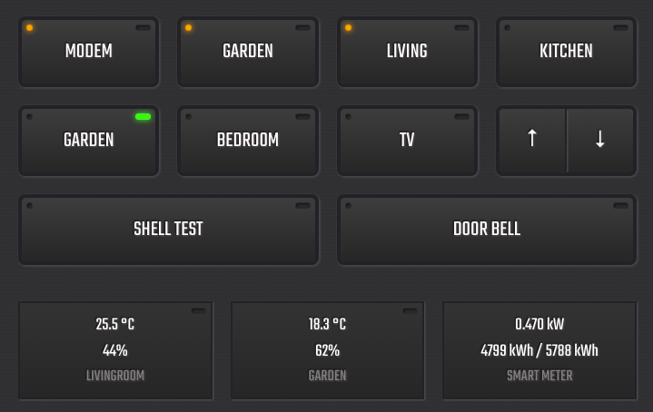

DOMUSTO website: https://domusto.com/

⚠️ _This project in alpha-state, so things might not work as expected._ ⚠️

# Introduction
DOMUSTO is versatile, extensible, plugin driven home automation software written in NodeJS. DOMUSTO is developed to run on a Raspberry Pi, but other Linux based systems should work as well.

This project is a web interface for the [DOMUSTO home automation server](https://github.com/basvdijk/domusto-server-nodejs)

# Screenshots (mobile and desktop)

   

# Setup

First make sure you have the DOMUSTO server up and running: https://github.com/basvdijk/domusto-server-nodejs

## Install npm packages

``` bash
npm install
```

## Setup configuration

Copy the config file template in the `src` folder to your own:

``` bash
cp src/config.example.js src/config.js
```

Edit the config file according to your setup.

## Start the client in development mode

```bash
npm run dev
```

## Hosting elsewhere

If you don't want to run the client in development mode you first need to build the client
```bash
npm run build
```

After building the `dist` folder contains the builded client. You can host the content of this directory on a server of your choice.

# domusto-client

## Project setup
```
npm install
```

### Compiles and hot-reloads for development
```
npm run serve
```

### Compiles and minifies for production
```
npm run build
```

### Lints and fixes files
```
npm run lint
```

### Customize configuration
See [Configuration Reference](https://cli.vuejs.org/config/).
